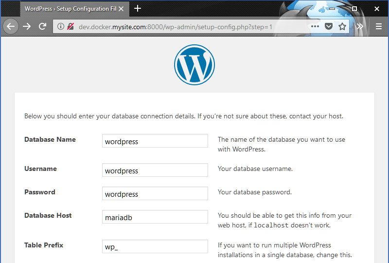
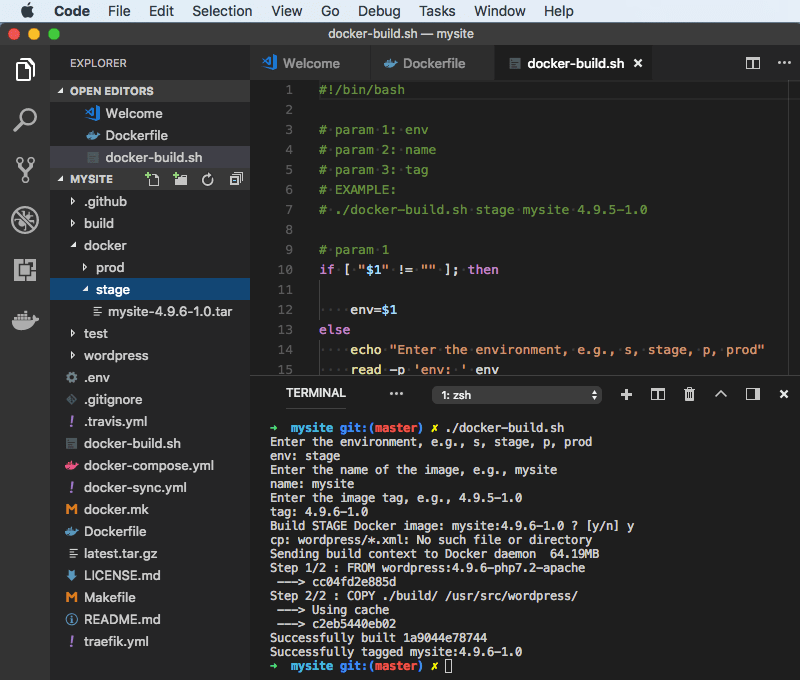

## WordPress usando o Docker

#####(do Desenvolvimento à Produção)

Como usar o Docker para um ambiente de desenvolvimento local do WordPress e como implantá-lo em um servidor Ubuntu Linux em execução.

O que você vai precisar.

     * Docker
     * VPS com Docker (para implantação de prod)
     * WordPress

O primeiro passo é o ambiente de desenvolvimento local configurado para o seu site WordPress. 
Usando git clone docker4wordpress em uma pasta do site. Por exemplo, meusite.
EX:
git clone https://github.com/wodby/docker4wordpress.git meusite
Update the .env file, for example:

```
PROJECT_NAME=meusite
PROJECT_BASE_URL=dev.docker.meusite.com

```
Atualize seu arquivo hosts de sistemas, por exemplo:

`127.0.0.1    dev.docker.meusitemeusite.com`

Exclua o **docker-compose.override.yml** como ele é usado para implantar o WordPress vanilla.

Baixe o WordPress e descompacte-o na pasta do site para que se tenha uma pasta do wordpress. Por exemplo, meusite / wordpress.

Opcionalmente, você pode baixar e extrair o WordPress usando o CLI, por exemplo:

```
cd mysite
wget http://wordpress.org/latest.tar.gz
tar xfz latest.tar.gz
```
###Docker Compose

Atualize os caminhos de volume **docker-compose.yml** para montar a base de código em ./wordpress em vez da raiz da pasta do site. Esta etapa é necessária para a configuração de construção. Por exemplo, para ambos os nós de serviços, nginx e php, substitua ./:/var/www/html por ./wordpress:/var/www/html.
```
...
    volumes:
      - ./wordpress:/var/www/html
```
Crie uma definição de volume nomeada para persistir os dados do mysql. Na parte inferior do arquivo docker-compose.yml, remova o comentário e atualize o nó de volumes. Por exemplo, substitua #volumes: com o seguinte:
```
volumes:
  mysql:

```
Atualize o serviço mariadb para usar o volume do mysql nomeado. Por exemplo, sob o nó dos serviços do mariadb, descomente e atualize o nó de volumes. Por exemplo:

```
services:
  mariadb:

    ...

    volumes:
      - mysql:/var/lib/mysql
```
Com o Docker em execução, a partir do diretório do site, por exemplo, meusite, execute o docker-compose up -d para iniciar os contêineres.

Agora o wp está pronto para carregar em um navegador, http://dev.docker.mysite.com:8000.

A página de instalação do WordPress deve aparecer. Depois de selecionar seu idioma, na tela seguinte, se estiver usando as configurações padrão no arquivo .env, digite wordpress para Nome do banco de dados, Nome de usuário e Senha. O valor do host do banco de dados é o nome do serviço definido no docker-compose.yml, no exemplo sera **mariadb**.

Exemplo:


Tema personalizado

Para demonstrar a inclusão de um tema personalizado na versão, fazeremos  uma cópia dos twentyseventeen e personalizá-lo.

```
cp -r wordpress/wp-content/themes/twentyseventeen wordpress/wp-content/themes/mytheme/

```
Faremos apenas uma pequena alteração no texto do título do site para mostrar o que você pode fazer para tornar o tamanho da fonte flexível para o padrão abaixo da largura da janela de visualização da área de trabalho.

Edite mytheme / style.css. Em Layout, adicione o tamanho da fonte: 5vw abaixo das regras de tamanho de fonte existentes. Por exemplo.

####style.css

```
.site-title {
  ...

  font-size: 24px;
  font-size: 1.5rem;
  font-size: 5vw;

```
Faça o login no site e ative mytheme para ver a alteração no tamanho da fonte do título do site ao ajustar a largura do navegador abaixo de 768 pixels de largura.

####Plugins

Para demonstrar a inclusão de plug-ins na compilação do docker, instale um plug-in que será incluído na base de código. Por exemplo, eu gosto do plugin Yoast SEO. Em vez de instalá-lo usando o painel, faça o download e extraia-o. Copie a pasta wordpress-seo para a pasta wordpress / wp-content / plugins. Você pode verificar a instalação fazendo login no painel do site e inspecionando a página de plug-ins.

####Imagem do Docker

A imagem do docker que criamos para preparação e produção será baseada na imagem oficial do WordPress e só precisará dos nossos temas, plugins e outras alterações do ambiente de desenvolvimento. Crie ou baixe este Dockerfile na pasta do seu site. A instrução FROM neste arquivo é configurada para usar a imagem de base oficial do WordPress. Você deve atualizar isso conforme necessário para usar a versão mais recente da imagem.

####Dockerfile
```
## https://github.com/docker-library/wordpress
FROM wordpress:4.9.6-php7.2-apache

## PHP extensions
## update and uncomment this next line as needed
# RUN docker-php-ext-install pdo pdo_mysql

## custom directories and files
## copy them here instead of volume
## /var/www/html/
## wordpress docker-entrypoint.sh runs
## chown -R www-data:www-data /usr/src/wordpress
COPY ./build/ /usr/src/wordpress/

```
Eu criei alguns scripts de construção para aceitar alguns parâmetros e copiar arquivos do ambiente de desenvolvimento em uma pasta de compilação para o Dockerfile. Atualize o script conforme necessário, configurando a variável THEME para que corresponda ao nome da pasta do seu tema personalizado do WordPress. por exemplo, THEME = "mysite". **Use o script apropriado para o seu ambiente.**

```
cd meusite

# download build script
wget https://raw.githubusercontent.com/jimfrenette/docker4wordpress/master/docker-build.sh

# if initial run,
# set script as executable
chmod +x docker-build.sh

# run
./docker-build.sh

```
Esta imagem mostra a execução do script de shell docker-build no terminal integrado VS Code. Observe que o explorador de arquivos no painel esquerdo contém o arquivo docker / stage / mysite-4.9.6-1.0.tar que foi criado.

_Execute o script de shell docker-build no vs code_

####Deployment

Depois de executar o script de construção, deve existir um arquivo .tar salvo nas pastas prod ou stage. Uma maneira de implantar a imagem é copiar o arquivo .tar para o servidor usando scp e carregá-lo.

Com o exemplo gilfoyle do usuário do Ubuntu, use scp da pasta stage.
```
# upload image
cd docker
scp mysite.tar gilfoyle@0.0.0.0:/home/gilfoyle/

```
Carregue a imagem do Docker no servidor.

```
# load image
ssh gilfoyle@0.0.0.0
docker load -i mysite.tar

```

**O exemplo de tudo isso esta na pasta wpApiRest**